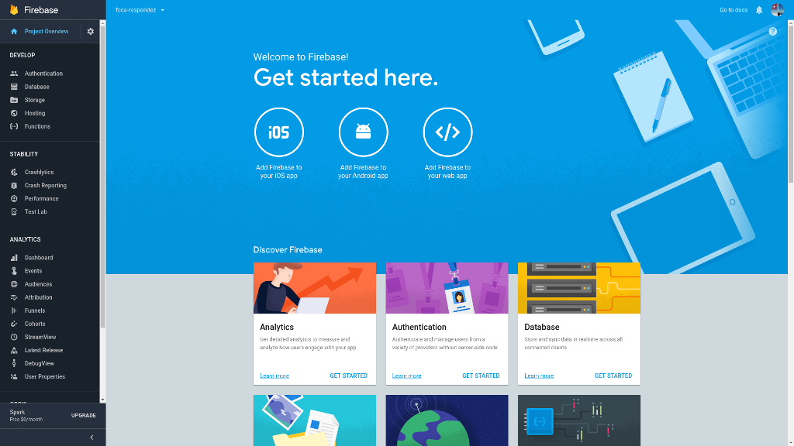
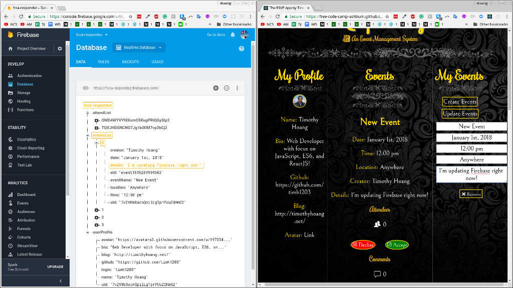

<figure><figcaption style=" text-align: center;">Respondez App</figcaption></figure>

# About
- The Respondez App is a lightweight event management system built with ReactJS and Firebase
- It was named off of the popular French expression "respondez s'il vous plait", or R.S.V.P. for short 
- I want to built this out of the desire for our [Free Code Camp Ashburn Group](https://free-code-camp-ashburn.github.io/website/) so we can manage our events external from popular platforms such as Facebook or Meetup
- Best used for other Free Code Camp Groups who want to have their own Event/RSVP/Comment system
- Designed best for developers since most devs have a github account (only supported platform on this app)

## Features
- Log in and authenticate with your Github account
- Event system for user to create, update, and remove their events
- RSVP system for user to add and remove their responses
- Comment system for user to write and delete their comments
- Events attend system for user to view past attended events

## Minor Features
- Always 3: The event list, user attended list, and the update event lists will only show the latest 3 entries respectively
- Spinning loader during login and page loading
- Deleted events are also removed from a user's attended list
- View user github description on hover over rsvp photo of Attendees section
- View date and time of comments on hover of Comments section
- View location of events on hover of My Events section

## Technologies
- [Create-React-App](https://github.com/facebookincubator/create-react-app) for the framework
- [Firebase](https://firebase.google.com/) for database storage
- [Immutability-Helper](https://github.com/kolodny/immutability-helper) for deep state manipulation
- [Github Pages](https://github.com/tschaub/gh-pages) for app deployment 
- [React Spinners](https://github.com/davidhu2000/react-spinners) for loading spinners
- See package.json for other technologies

## To view this app online
- To view deployed app, visit: https://timh1203.github.io/respondez-app/ 

## To use the app for your own group
* You can simply fork the repo for your own github account
* The following are instructions for cloning a copy for a group IE free-code-camp-ashburn is my group
1. Have NPM and NodeJS installed on your computer
2. Create a new repo in your github account for your organization and clone that to your computer, name the folder "respondez"

<figure><figcaption style=" text-align: center;">Step 2: click on the "New" button</figcaption></figure>

3. Visit the [respondez app github repository](https://github.com/timh1203/respondez-app) (master branch) and download the zip
4. Extract the zip file and copy the contents of "respondez-app-master" folder into the "respondez" folder

<figure><figcaption style=" text-align: center;">Step 4 and 5: Copy contents of zip file into "respondez" folder</figcaption></figure>

5. You can now delete the "respondez-app-master" folder and "respondez-app-master.zip" file

6. Sign up for an account at [Firebase](https://firebase.google.com/) and add a new project, you can name it anything you want
7. Go to the Authentication section on the left bar and go to Sign-In Method

<figure><figcaption style=" text-align: center;">Step 7: Click on Authentication section</figcaption></figure>

8. Enable Github as a sign-in provider and copy the "authorization callback URL" IE https://fcca-respondez.firebaseapp.com/__/auth/handler
9. Go to your [Github](https://github.com/) account > Settings > Developer Settings, and register a new New OAuth App
(Application Name, Homepage URL from your github pages settings, Application Description, and Authorization callbackURL from Firebase)

<figure><figcaption style=" text-align: center;">Step 9: Fill in all the information</figcaption></figure>

10. Grab the Client ID and Secret and paste it to Firebase and save
11. Also add the Homepage URL from your github pages settings and paste it in the "Authorized Domain" of your Authentication section
12. Click on the gear icon next to project overview and project settings, click on "Add Firebase to your web app" and copy everything inside of the config variable
13. Open up the respondez folder and find baseExample.js in "/src/helpers/baseExample.js", paste everything inside the app variable

<figure><figcaption style=" text-align: center;">Step 12 and 13: Copy and paste credentials</figcaption></figure>

14. Rename "baseExample.js" to "base.js"
15. Now open your terminal and navigate to the directory where you had the respondez folder.
16. Run `npm install` or `sudo npm install` to get all the dependencies.
17. Follow these steps for [create-react-app deployment](https://github.com/facebookincubator/create-react-app/blob/master/packages/react-scripts/template/README.md#github-pages), then follow the steps under "Github Pages" (You will be deploying a "project page" so you only need the first set of server scripts, not the "user page" scripts)

<figure><figcaption style=" text-align: center;">Step 17: Follow the deployment instructions carefully</figcaption></figure>

18. Feel free to remove the comments & proptypes from the components folder and the sample files in data folder
19. Run `npm start` to start the server (the app should auto-load with Create React App, otherwise, navigate to `localhost:3000` on your browser)
20. Then you can head over to database section of Firebase to see as live data persists when you make a change in the app.

<figure><figcaption style=" text-align: center;">Step 20: Congratulations! You're ready to go!</figcaption></figure>

# More pictures
<figure><figcaption style=" text-align: center;">RSVP to events and add comments with your friends!</figcaption></figure>

<figure><figcaption style=" text-align: center;">Create a new event with all the details!</figcaption></figure>

<figure><figcaption style=" text-align: center;">Edit events with live updates!</figcaption></figure>

<figure><figcaption style=" text-align: center;">Log in before you can see the app!</figcaption></figure>